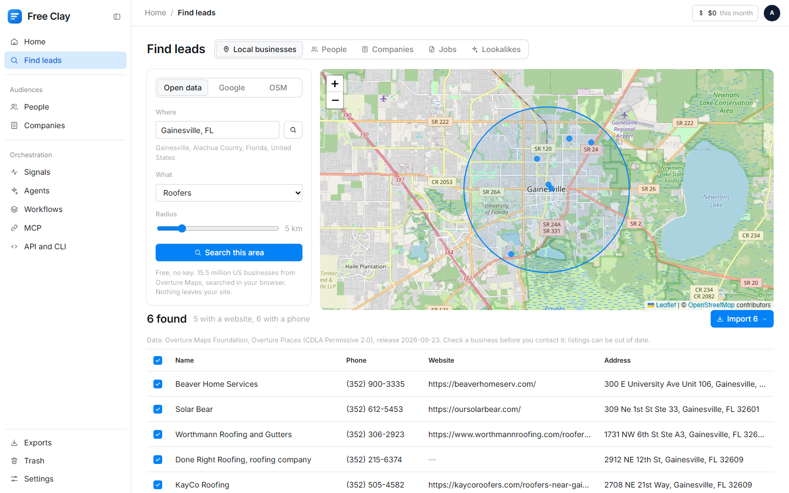
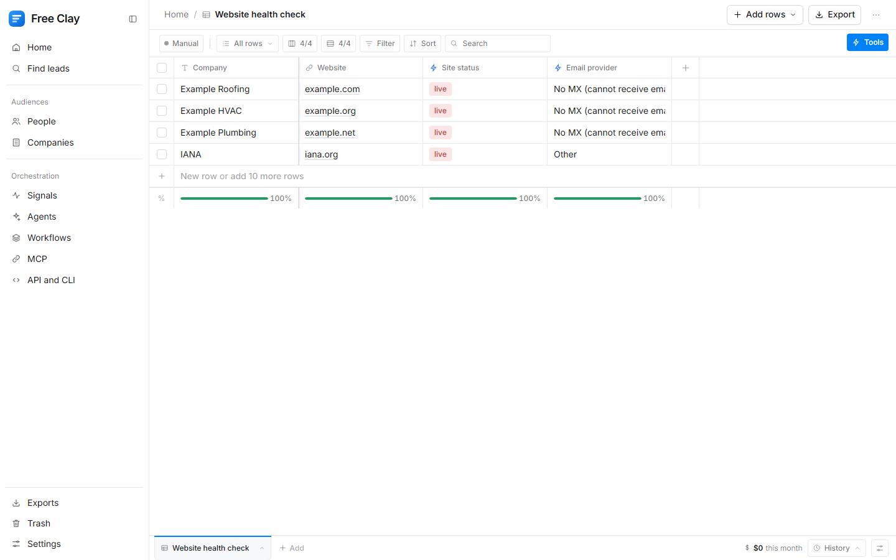
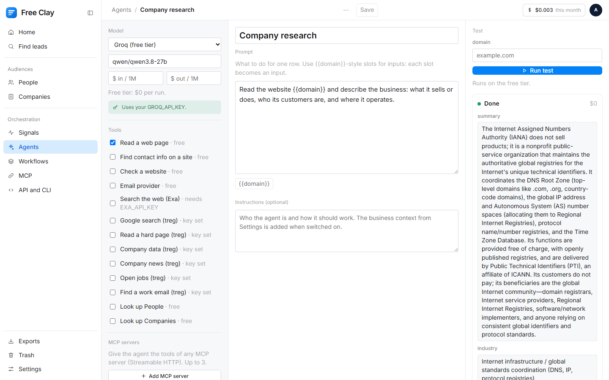
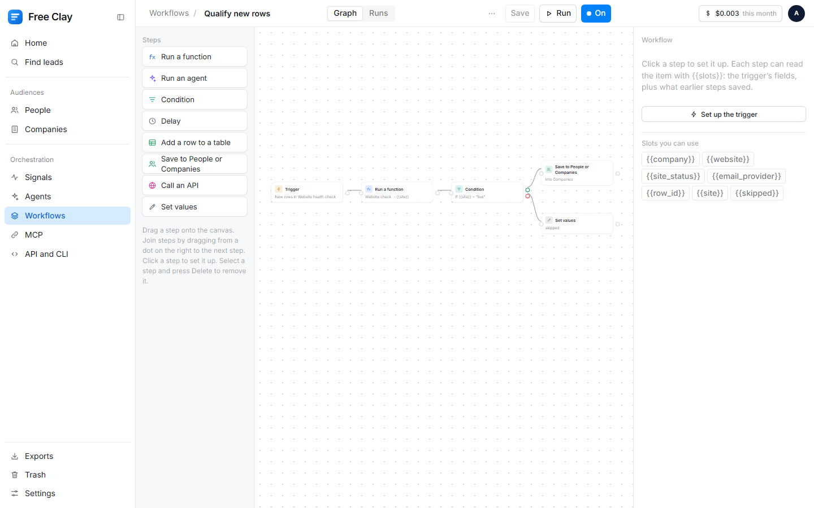
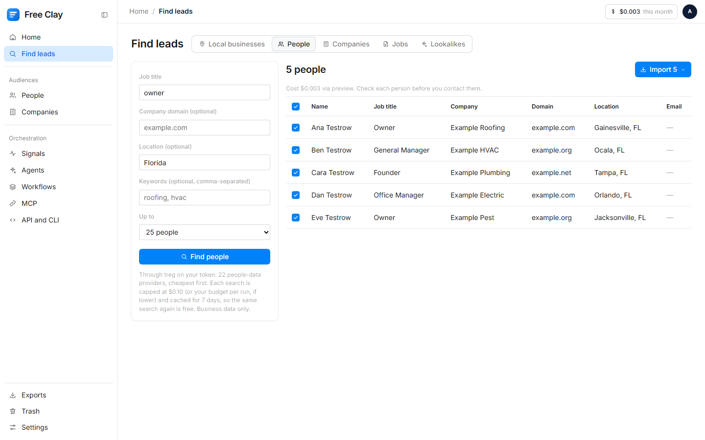
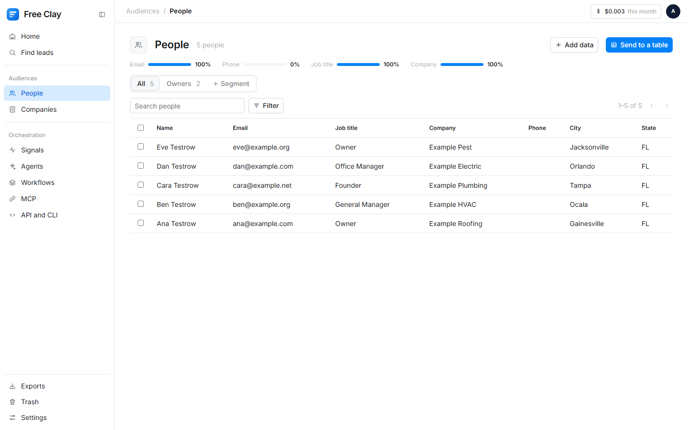
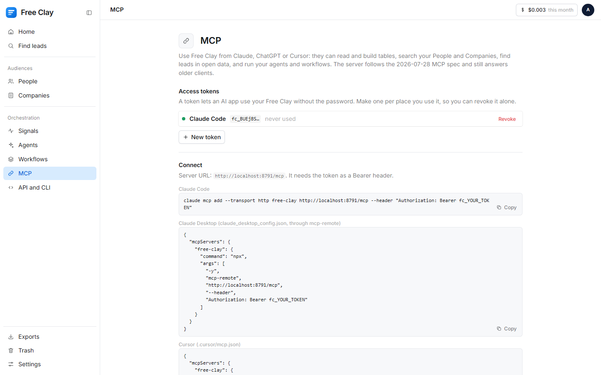

# Free Clay

**A Clay-style lead workspace you own.** Find leads, enrich them in tables with waterfalls, keep
People and Companies databases, run AI agents, automate with workflows, watch signals, and drive it
all from Claude through MCP. It runs on **your own Cloudflare account for $0 a month**. You pay
providers directly, at their price, only when you run them; plenty works for free.

> Not affiliated with Clay Labs. "Clay" is their name; this is an independent, open-source rebuild
> (MIT). Clay's prices below are Clay's own figures, read in its app on 2026-09-27/28.



## Why

Clay is two products: software and data. Its Launch plan is $185 a month, the HTTP API column needs
Growth at $495 a month, and data costs credits on top ($0.05 each on Launch). Free Clay rebuilds the
software and reaches the data at the provider's price:

| Job | Clay (Clay's figures) | Free Clay |
|---|---|---|
| The software | $185 to $495 a month | **$0** (Cloudflare free plan) |
| Local businesses | $0.05 per Google Maps result | **$0**: 15.5M US businesses from open data |
| Company enrichment | $0.025 a row | ~$0.0019 through [treg](https://treg.to) (measured) |
| Work email waterfall | ~$0.055 a row | ~$0.0048 a hit through treg (treg's price), verified |
| AI column or agent | 1 to 45 credits a row | $0 on Groq's free tier, or any model at its token price |

Every Clay feature and its Free Clay equivalent: [docs/FEATURES.md](docs/FEATURES.md).

## What's inside

- **Find leads:** local businesses on a map (free open data, or Google Maps), **people** by title,
  company and place (through treg), companies (SEC, Wikidata), open jobs (Greenhouse, Lever, Ashby),
  lookalike companies (Exa).
- **Tables:** 29 enrichment functions (9 free), waterfalls with validation, AI and Agent columns,
  formulas (write one from a sentence), any HTTP API, a budget cap on every run and a ledger of
  every call. Nine ready-made templates.
- **Audiences:** People and Companies databases, deduplicated, with where each value came from, and
  segments.
- **Agents:** research, score and draft on your own model key, with web tools, treg tools and any MCP
  server; a step limit and budget on every run.
- **Workflows:** a drag-and-drop canvas: new rows, new segment members, schedules, webhooks or signals
  start steps like functions, agents, conditions, delays and "save to People".
- **Signals:** new job posts, website changes, news, SEC filings (free), job changes (treg).
- **Send:** HubSpot, Instantly, Smartlead, any webhook. Drafts only from agents; nothing sends by itself.
- **MCP server, REST API and CLI:** 21 MCP tools for Claude, ChatGPT and Cursor; `/api/v1` with
  tokens; `bin/free-clay.mjs`.

| | |
|---|---|
|  |  |
|  |  |
|  |  |

More in [docs/screenshots](docs/screenshots), light, dark and phone.

## Set it up (about 15 minutes)

You need Node.js 22+, git and a free Cloudflare account. Pick one way.

**A. One command** (asks as it goes):

```bash
git clone https://github.com/mertozcetinwd-lab/free-clay.git
cd free-clay
npm install
npm run setup
```

**B. With your AI coding agent** (Claude Code, Cursor, Codex). Open it in an empty folder and paste:

> Clone https://github.com/mertozcetinwd-lab/free-clay, read its AGENTS.md, and set Free Clay up on
> my Cloudflare account. Hand me the terminal for the Cloudflare login and for every key. Never ask
> me to paste a key into the chat.

**C. By hand:** every command is in [docs/SETUP.md](docs/SETUP.md).

**Two things only you can do:** sign in to Cloudflare when a browser opens, and type each key into
wrangler's own prompt (`npx wrangler secret put NAME`) so it goes straight to Cloudflare. Which keys,
where to get them and what they cost: [docs/KEYS.md](docs/KEYS.md). None is required; start with
**Groq** (free) and **treg** (one token, provider prices).

**Try it first without Cloudflare:** `npm run preview`, then http://localhost:8787 (password
`preview`). Every provider is faked there, so nothing is called and nothing costs money.

## Docs

| | |
|---|---|
| [SETUP](docs/SETUP.md) | Every step, what you do and what the script does, updating later |
| [KEYS](docs/KEYS.md) | Each key: what it unlocks, cost, link, command |
| [DATA](docs/DATA.md) | The free data (15.5M businesses, SEC, Wikidata, job boards) and its licences |
| [MCP](docs/MCP.md) | Connect Claude, Cursor or ChatGPT; the 21 tools |
| [FEATURES](docs/FEATURES.md) | Every Clay feature, and what Free Clay does instead |
| [CLAY-COMPARISON](docs/CLAY-COMPARISON.md) | One small workflow run in Clay and in Free Clay: what each returned and what it cost |
| [TROUBLESHOOTING](docs/TROUBLESHOOTING.md) | Messages you might see, and the fix |
| [AGENTS.md](AGENTS.md) | Instructions for AI coding agents working on this repo |
| [PROMPT](PROMPT.md) / [PROMPT-FULL](docs/PROMPT-FULL.md) | Build it from scratch with one prompt |

## What it does not do, on purpose

- **No LinkedIn scraping or LinkedIn data**: it breaks LinkedIn's terms. LinkedIn fields a provider
  returns are dropped.
- **No mailbox probing** from the Worker: verification goes to a provider (treg or Hunter).
- **No sending by itself**: agents draft, your sequencer or CRM sends under your name. CAN-SPAM (US)
  and GDPR (EU) duties sit with the sender.
- **No resold database**: the data is open data you can check, your own imports, and the providers
  you choose to pay.

## How it is built

One Cloudflare Worker and one D1 database, plain JavaScript modules, no framework, no build step,
no runtime dependencies. The free plan's limits (50 outbound requests and 50 database queries per
invocation) are why every fetch goes through a queue that plans within them. Leaflet (BSD-2) draws
the map and Drawflow (MIT) the workflow canvas, both vendored with their licences.

```bash
npm test          # 200+ tests, no network
npm run mutate    # plants real bugs one at a time; the tests must catch every one
```

MIT licensed. Built by [Mert Ozcetin](https://mertozcetin.kit.com): *build it, don't rent it.*
Data: Overture Maps Foundation, Overture Places (CDLA Permissive 2.0).
